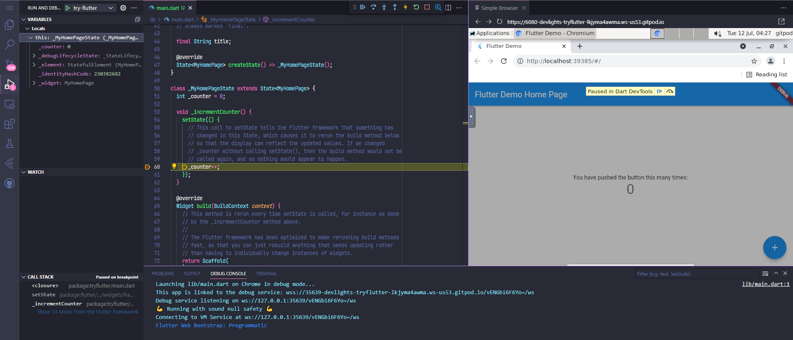

# try-flutter

This is my TUTORIAL project for flutter.

This project is intended to run on gitpod.

## flutter version

```sh
gitpod /workspace/try-flutter (main) $ flutter --version
Flutter 3.0.4 • channel stable • https://github.com/flutter/flutter.git
Framework • revision 85684f9300 (11 days ago) • 2022-06-30 13:22:47 -0700
Engine • revision 6ba2af10bb
Tools • Dart 2.17.5 • DevTools 2.12.2
```

## flutter doctor

```sh
gitpod /workspace/try-flutter (main) $ flutter doctor
Doctor summary (to see all details, run flutter doctor -v):
[✓] Flutter (Channel stable, 3.0.4, on Ubuntu 20.04.4 LTS 5.15.0-40-generic, locale en_US.UTF-8)
[✓] Android toolchain - develop for Android devices (Android SDK version 31.0.0)
[✓] Chrome - develop for the web
[✓] Linux toolchain - develop for Linux desktop
[!] Android Studio (not installed)
[✓] Connected device (2 available)
[✓] HTTP Host Availability

! Doctor found issues in 1 category.
```

## Run

```sh
gitpod /workspace/try-flutter (main) $ flutter run
Multiple devices found:
Linux (desktop) • linux  • linux-x64      • Ubuntu 20.04.4 LTS 5.15.0-40-generic
Chrome (web)    • chrome • web-javascript • Chromium 95.0.4638.54 Ubuntu
[1]: Linux (linux)
[2]: Chrome (chrome)
Please choose one (To quit, press "q/Q"): [Your choice]
```

After a while, an application will be launched on VNC, and VNC will be assigned to port 6080, so open it.

Debugging and Hot Reload features can be done normally. Thanks Gitpod!! :)




## References

- [gitpod-io/template-flutter](https://github.com/gitpod-io/template-flutter)
  - The gitpod.yml and gitpod.Dockerfile are copied from this repository.
  - If used as is, apt-get will generate an error and the pre-build will not succeed, so I adjusted the Dockerfile based on the contents of https://github.com/gitpod-io/workspace-images/issues/872.